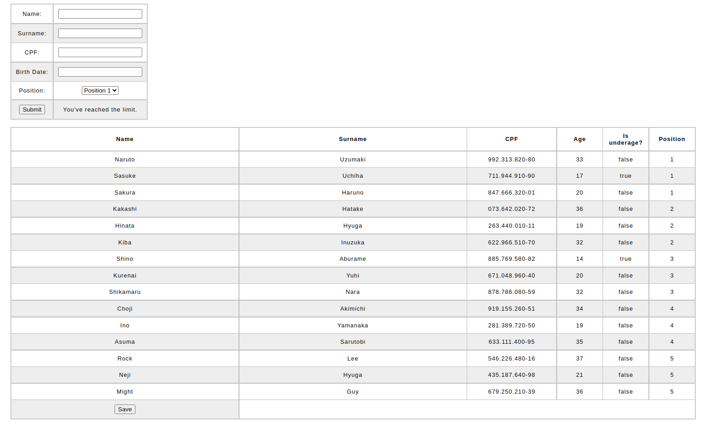
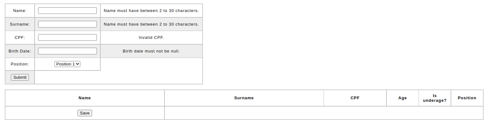

# Projeto de cadastro de candidatos.
Projeto realizado usando thymeleaf e Spring Boot MVC.

O formulário solicita informações do candidato, sendo:
1. Name;
2. Surname;
3. CPF;
4. Birth Date;
5. Position.

Name e surname deverão conter no minimo 2 letras, o cpf tera que ser um cpf válido e não podera ser duplicado.

Position refere-se ao número da vaga que o candidato será cadastrado, podendo ser escolhido entre position 1 a 5.

Qualquer campo que falte preenchimento ou que o preenchimento esteja incorreto, gerará uma informação ao usuário.

